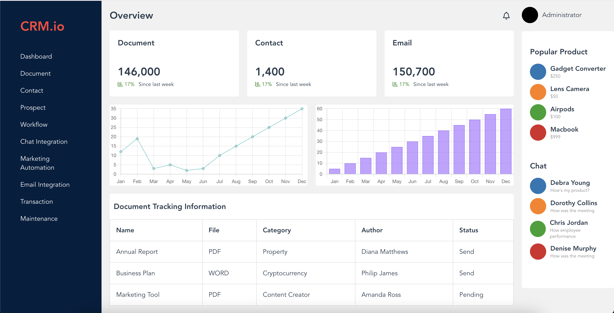

# Dashboard-UI

## Project Description

Dashboard UI created using HTML and Pure CSS (no frameworks like Bootstrap or Tailwind). The project uses Vue3.




## Technologies Used

- HTML
- Pure CSS
- Vue3
- Vue CLI
- Font Awesome
- Charts.js

### Project Structure

- **public/**: Contains files that will be served directly by the web server.
  
- **src/**
  - **assets/**: Contains uploaded assets.
  - **components/**: Contains Vue components required for building this page.
  - **App.vue**: The main Vue component.
  - **main.js**: The entry point for Vue application.

- **vue.config.js**: Configuration file for Vue CLI.


## Setup steps

1. Clone the repository
    ```bash
    git clone https://github.com/Jigyasa08/Dashboard-UI.git`
    ```
2. Navigate to project base directory
    ```bash
    cd Dashboard-UI
    ```
3. Install package dependecies
    ```bash 
    npm install 
    ```

4. Run project, Compiles and hot-reloads for development
    ```bash
    npm run serve
    ```

### Compiles and minifies for production
```bash
npm run build
```


### Contact Information
For any inquiries or feedback, please reach out to me at [jkaushik0802@gmail.com](mailto:jkaushik0802@gmail.com).

